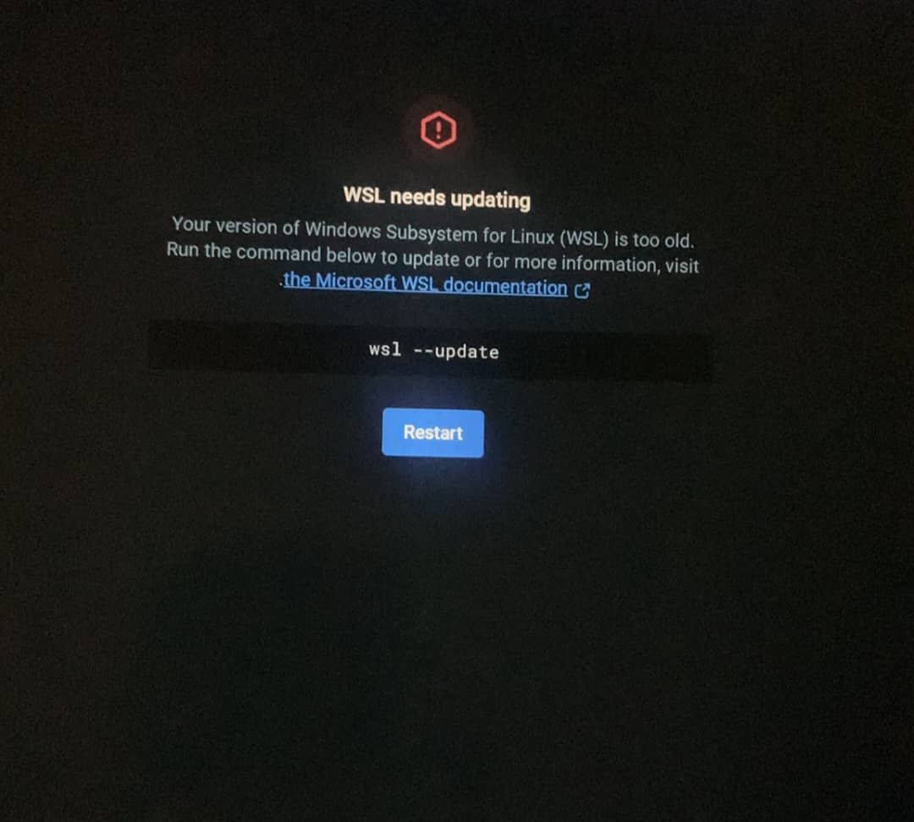

# Fix: Docker Desktop keeps stopping because `wsl --update` hangs

> A practical, step-by-step troubleshooting guide and reproducible checklist for resolving WSL ↔ Docker Desktop issues on Windows. Includes solution for a stuck `wsl --update` (0.0%) and network-related failures (mobile MiFi/ISP DNS blocking).

---

## TL;DR (Quick checklist)

1. Run PowerShell **as Administrator** and try `wsl --update`.
2. If it hangs at `0.0%`, manually download & install the WSL update MSI (`wsl_update_x64.msi`).
3. Reboot, set default WSL version to 2 and convert your distro: `wsl --set-default-version 2` and `wsl --set-version <DistroName> 2`.
4. Enable Docker Desktop WSL integration for your distro and restart Docker.
5. If `docker pull` fails on an ISP (e.g., MiFi), switch networks or set Docker daemon DNS to `8.8.8.8`/`8.8.4.4`.

---

## Repository purpose and scope

This repo documents reproducible steps, commands, screenshots and recommended workarounds for the following problems:

* `wsl --update` hangs at `0.0%` during update
* Docker Desktop repeatedly shows **"WSL needs updating"** and **Engine stopped**
  

[View full-size image](screenshots/Wsl-docker-update.jpeg)

* `docker run` or `docker pull` hangs or errors due to DNS/ISP issues (mobile MiFi)


[View full-size image](screenshots/Network-problem.jpeg)

It is written for Windows 10/11 users who use Docker Desktop with WSL 2 backend.

---

## Environment

* Windows 10 Pro 22H2 (build OS Build 19045.6282)
* CPU: Intel Core i5-6300U (supports VT-x)
* WSL: initially v1 → upgraded to WSL 2
* Docker Desktop: (record the installed version)
* Distro: Ubuntu-22.04 
* Network: note if you encountered issues over a mobile MiFi (ISP) and that a switch to a different ISP fixed downloads

---

## Reproduction steps (how someone else can see the bug)

1. Install Docker Desktop with WSL 2 backend.
2. Install WSL and a distro (Ubuntu-22.04).
3. Run `wsl --update` in an Admin PowerShell and observe it either finish or hang at `0.0%`.
4. Open Docker Desktop — it may show **WSL needs updating** and the engine may show **stopped**.
5. Try `docker run hello-world` — it may hang with no output.

---

## Complete step‑by‑step fix 

> Perform each step exactly in order. Copy-paste the commands into Admin PowerShell where shown.

### A. Preliminary checks

1. Confirm virtualization is enabled in Task Manager (Performance → CPU → "Virtualization: Enabled").
2. Confirm Windows features are enabled (`optionalfeatures.exe`): check *Hyper-V*, *Virtual Machine Platform*, *Windows Hypervisor Platform*, *Containers* (Hyper-V optional if you're using WSL 2, but enabling VM Platform and WSL is required).

### B. Try the built-in update first (Admin PowerShell)

```powershell
wsl --update
wsl --status
```

If `wsl --update` progresses and finishes, run `wsl --shutdown` and reboot, then skip to section D.

### C. Manual WSL kernel update (when `wsl --update` hangs at 0.0%)

1. Download the WSL kernel MSI manually from Microsoft:

   * Official link: `https://github.com/microsoft/WSL/releases` (or `https://wslstorestorage.blob.core.windows.net/wslblob/wsl_update_x64.msi`)
   * If the download times out on your network, try a different ISP, tether to a phone with a different carrier, or use a VPN.
2. Run the downloaded `wsl_update_x64.msi` (double-click) and follow the installer.
3. Reboot the machine.

### D. Confirm WSL version and convert distro to v2

Open Admin PowerShell and run:

```powershell
wsl --version
wsl --list --verbose
wsl --set-default-version 2
# Convert distro if it still shows VERSION 1. Replace name with exact entry from wsl --list --verbose
wsl --set-version "Ubuntu-22.04" 2
```

Allow conversion to finish—this may take several minutes depending on disk size.

### E. Docker Desktop: enable WSL 2 integration

1. Open Docker Desktop → Settings → General: enable **Use the WSL 2 based engine**.
2. Settings → Resources → WSL Integration: enable the toggle for the default distro and explicitly for `Ubuntu-22.04`.
3. Apply & Restart Docker Desktop.

### F. Test Docker functionality

From PowerShell or WSL terminal:

```powershell
wsl --shutdown   # ensure WSL is restarted cleanly
# Check Docker engine status in Docker Desktop UI
docker run hello-world
docker info
```

You should get the hello-world message and `docker info` should print daemon details.

### G. DNS/Network issues (ISP-specific)

If `docker pull` or other network ops fail with `getaddrinfo`/`lookup`/`ERR_TIMED_OUT`:

1. Try the pull on a different network (mobile tether on another carrier, home broadband). If it works on another network, ISP-level filtering is likely the cause.
2. Set Docker daemon DNS to public DNS servers:

   * Docker Desktop → Settings → Docker Engine
   * Add a `dns` key to the JSON config, e.g.:

```json
{
  "dns": ["8.8.8.8", "8.8.4.4"]
}
```

Click **Apply & Restart**.
3\. Alternatively, use a VPN that routes DNS properly.
4\. Test DNS inside a container:

```bash
docker run --rm busybox nslookup google.com
```

If this resolves names using the configured DNS, retry `docker pull`.

### H. Clean reinstall (if Docker engine still unstable)

1. `wsl --shutdown`
2. Uninstall Docker Desktop (choose to delete data when prompted).
3. Remove leftover folders if present:

   * `C:\ProgramData\DockerDesktop`
   * `%USERPROFILE%\.docker`
   * `%LOCALAPPDATA%\Docker`
   * `%APPDATA%\Docker`
4. Reboot.
5. Reinstall latest Docker Desktop, choose **Use WSL 2** and enable integration with your distro during install.

---

## Troubleshooting commands & logs to collect

* `wsl --list --verbose`
* `wsl --status`
* `wsl --version`
* `docker version`
* `docker info`
* `wsl --shutdown` then `docker run --rm busybox nslookup production.cloudflare.docker.com`
---

## License

This guide is provided under the **MIT License**. 

---
